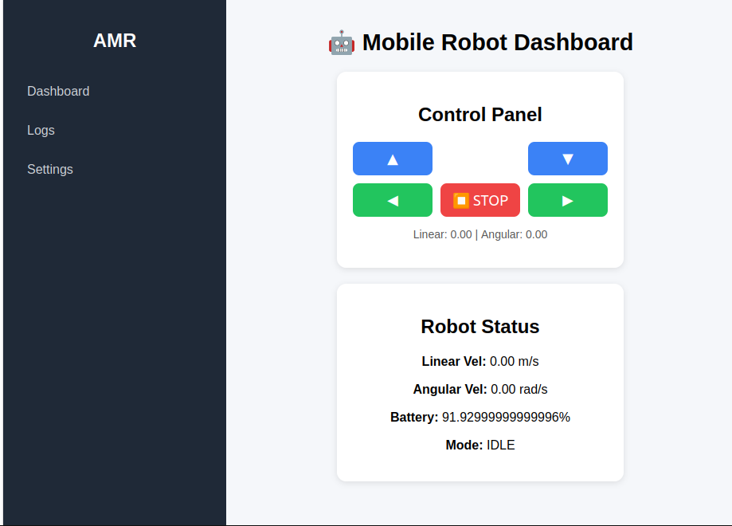

# Mobile Robot Project

This repository contains both the frontend and backend for a mobile robot control and monitoring system.

---

## Frontend: Mobile Robot Frontend

This is a React-based frontend application for controlling and monitoring a mobile robot.

### Prerequisites

- Node.js 20.x or higher
- npm (Node Package Manager)

### Installation

1. **Install Node.js (Ubuntu/Debian):**
    ```bash
    curl -fsSL https://deb.nodesource.com/setup_20.x | sudo -E bash -
    sudo apt install -y nodejs
    npm install roslib ros3d three

    ```
    Verify installation:
    ```bash
    node -v
    npm -v
    ```

2. **Set Up the Project:**
    ```bash
    npx create-react-app mobile-robot-frontend
    cd mobile-robot-frontend
    ```

3. **Start Development Server:**
    ```bash
    npm start
    ```
    The app will be available at [http://localhost:3000](http://localhost:3000).

### Project Structure

```
mobile-robot-frontend/
├── public/
│   ├── index.html
│   ├── manifest.json
│   └── robots.txt
└── src/
     ├── App.js
     ├── App.css
     ├── index.js
     └── ...
```
# Image


# Gif


### Development

1. Make changes to the files in the `src` directory
2. The development server will automatically reload
3. View changes in your browser


## Backend: Robot Backend

This folder contains the backend server for the mobile robot project, built with FastAPI and Uvicorn.

### Prerequisites

- Python 3.8 or higher
- pip (Python package manager)
pip install "uvicorn[standard]" websockets wsproto numpy transforms3d


### Setup Instructions

1. **Create and Enter the Backend Folder:**
    ```bash
    mkdir robot-backend
    cd robot-backend
    ```

2. **Save the Main Application File:**
    Create a file named `main.py` in this folder. Example content:
    ```python
    from fastapi import FastAPI

    app = FastAPI()

    @app.get("/")
    def read_root():
         return {"message": "Robot backend is running!"}
    ```

3. **Install Dependencies:**
    ```bash
    pip install fastapi uvicorn
    ```

4. **Run the Backend Server:**
    ```bash
    uvicorn main:app --reload
    ```
    The backend will be available at [http://localhost:8000](http://localhost:8000).

### Project Structure

```
robot-backend/
├── main.py           # Main FastAPI application
└── ...               # Additional backend files
```

---

## License

[MIT License](LICENSE)
