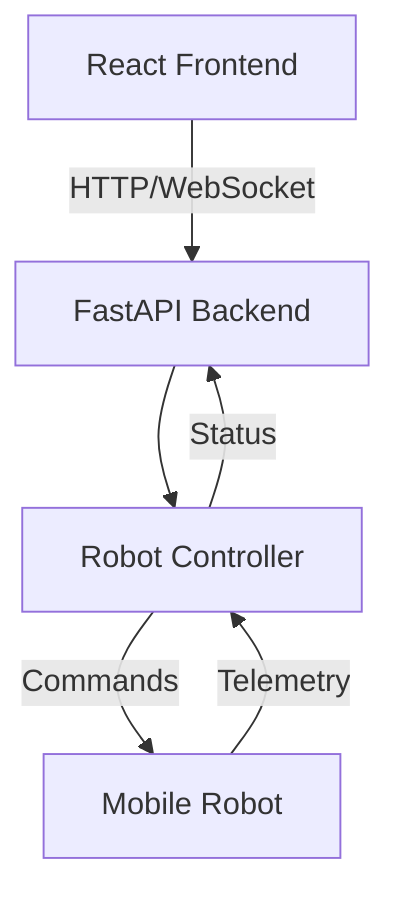

# Mobile Robot Control System

[](https://github.com/EdwinGeorge1/ui/issues)
[](https://github.com/EdwinGeorge1/ui/blob/main/LICENSE)
[](https://www.python.org/downloads/)
[](https://fastapi.tiangolo.com)
[](https://reactjs.org/)

Modern web-based control interface for autonomous mobile robots. This project provides a complete stack for robot teleoperation, monitoring, and autonomous navigation, combining a React-based operator interface with a FastAPI backend.

_🚧 Status: Active Development_

## System Architecture



### Key Components

- **Frontend**: React-based operator interface
- **Backend**: FastAPI server with real-time capabilities
- **Communication**: REST API + WebSocket for real-time updates
- **Monitoring**: Real-time robot status and telemetry
- **Control**: Direct teleoperation and waypoint navigation

## ✨ Key Features

- 🎮 Real-time robot control interface
- 📊 Live status monitoring and telemetry
- 🗺️ Interactive map view for navigation
- 📝 Detailed logging system
- ⚡ Fast and efficient FastAPI backend
- 🔄 WebSocket-based real-time updates


---

## Quick Start

### Prerequisites

#### Frontend Requirements
- Node.js 20.x or higher
- npm (Node Package Manager)

#### Backend Requirements
- Python 3.8+
- pip
- uvicorn

### Build & Installation

1. **Install Node.js (Ubuntu/Debian):**
    ```bash
    curl -fsSL https://deb.nodesource.com/setup_20.x | sudo -E bash -
    sudo apt install -y nodejs
    npm install roslib ros3d three

    ```
    Verify installation:
    ```bash
    node -v
    npm -v
    ```

2. **Set Up the Project:**
    ```bash
    npx create-react-app mobile-robot-frontend
    cd mobile-robot-frontend
    ```

3. **Start Development Server:**
    ```bash
    npm start
    ```
    The app will be available at [http://localhost:3000](http://localhost:3000).

### Project Structure

```
mobile-robot-frontend/
├── public/
│   ├── index.html
│   ├── manifest.json
│   └── robots.txt
└── src/
     ├── App.js
     ├── App.css
     ├── index.js
     └── ...
```
# Image


# Gif

### Development

1. Make changes to the files in the `src` directory
2. The development server will automatically reload
3. View changes in your browser


## Backend: Robot Backend

This folder contains the backend server for the mobile robot project, built with FastAPI and Uvicorn.

### Prerequisites

- Python 3.8 or higher
- pip (Python package manager)
pip install "uvicorn[standard]" websockets wsproto numpy transforms3d


### Setup Instructions

1. **Create and Enter the Backend Folder:**
    ```bash
    mkdir robot-backend
    cd robot-backend
    ```

2. **Save the Main Application File:**
    Create a file named `main.py` in this folder. Example content:
    ```python
    from fastapi import FastAPI

    app = FastAPI()

    @app.get("/")
    def read_root():
         return {"message": "Robot backend is running!"}
    ```

3. **Install Dependencies:**
    ```bash
    pip install fastapi uvicorn
    ```

4. **Run the Backend Server:**
    ```bash
    uvicorn main:app --reload
    ```
    The backend will be available at [http://localhost:8000](http://localhost:8000).

### Project Structure

```
robot-backend/
├── main.py           # Main FastAPI application
└── ...               # Additional backend files
```

---

how to Run 
run a mobile robot 

then 
ros2 run rosbridge_server rosbridge_websocket
npm start  - for frontend
uvicorn main:app --reload --host 0.0.0.0 --port 8000 -for backend
## API Reference

### REST Endpoints

| Endpoint | Method | Description |
|----------|--------|-------------|
| `/` | GET | Health check |
| `/status` | GET | Get robot status |
| `/cmd_vel` | POST | Send velocity commands |
| `/logs` | GET | Get system logs |

### WebSocket Events

| Event | Direction | Description |
|-------|-----------|-------------|
| `status_update` | Server → Client | Real-time robot status updates |
| `cmd_vel` | Client → Server | Velocity command streaming |
| `log_entry` | Server → Client | Real-time log updates |

## Development


## Contributing

1. Review the [Contributing Guidelines](CONTRIBUTING.md)
2. Fork the repository
3. Clone your fork
4. Create a feature branch
   ```bash
   git checkout -b feature/amazing-feature
   ```
5. Make your changes
   - Follow the style guides
   - Add tests for new features
   - Update documentation
6. Push your branch
7. Create a Pull Request

## Roadmap

### v1.0 (Current)
- [x] Basic teleoperation
- [x] Real-time status monitoring
- [x] Logging system
- [x] Map visualization

### v1.1 (Planned)
- [ ] Multi-robot support
- [ ] Advanced path planning
- [ ] 3D visualization

## Support & Community

- [Issue Tracker](https://github.com/EdwinGeorge1/ui/issues)
- [Discussions](https://github.com/EdwinGeorge1/ui/discussions)
- [Contributing Guidelines](CONTRIBUTING.md)

## License

This project is licensed under the MIT License - see the [LICENSE](LICENSE) file for details.

## Citation

If you use this software in your research, please cite:

```bibtex
@software{mobile_robot_control_2025,
  author = {George, Edwin},
  title = {Mobile Robot Control System},
  year = {2025},
  publisher = {GitHub},
  url = {https://github.com/EdwinGeorge1/ui}
}
```

## Acknowledgments

- React.js Community
- FastAPI Team
- All contributors

---

<div align="center">

Made with passion for robotics by the Mobile Robot Control team.

[](https://star-history.com/#EdwinGeorge1/ui&Date)

</div>
